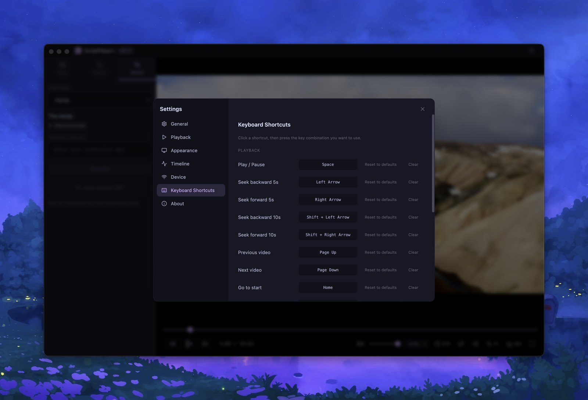

<p align="center">
  
</p>

<h1 align="center">ScriptPlayer+ Moon Edition</h1>

<p align="center">
  A modern desktop player for <b>local funscript playback</b>, with a cleaner playback UI,
  <b>The Handy</b> sync, <b>Intiface / Buttplug</b> multi-axis routing, <b>FunOSR serial</b> support,
  in-app <b>EroScripts</b> browsing, and a media library that is actually pleasant to use. 
<u>Please note this is a fork that i am maintaining for personal use and may not be actively maintained by the original author.
I will try to merge changes in the upstream to try and keep feature parity with the upstream.</u>
</p>

<p align="center">
  <a href="https://github.com/technomooney/scriptplayer-plus/releases/latest">
    
  </a>
  <a href="https://github.com/technomooney/scriptplayer-plus/releases/latest">
    
  </a>
  
  
</p>

<p align="center">
  <a href="https://github.com/technomooney/scriptplayer-plus/releases/latest"><b>Download Latest Release</b></a>
  ·
  <a href="docs/readme-media/overview-demo.mp4"><b>Watch Overview Demo</b></a>
  ·
  <a href="docs/README_KO.md">한국어</a>
  ·
  <a href="docs/README_JA.md">日本語</a>
  ·
  <a href="docs/README_ZH.md">中文</a>
</p>

---

<p align="center">
  <a href="docs/readme-media/overview-demo.mp4">
    
  </a>
</p>

<p align="center">
  Click the hero image or the demo cards below to open the short product videos.
</p>

## Why ScriptPlayer+ Moon Edition

ScriptPlayer+ Moon Edition is for people who already have local media and scripts, but want a player that feels current instead of patched together.
The point is straightforward: cleaner playback, cleaner device control, and a library workflow that does not waste time.

<table>
  <tr>
    <td style="width:33%">
      <b>Playback-first UI</b><br>
      Fullscreen playback, timeline and heatmap overlays, subtitle support, audio artwork mode, and quick stroke controls without burying everything in menus.
    </td>
    <td style="width:33%">
      <b>Device support that scales</b><br>
      Use The Handy, Intiface / Buttplug devices, or direct FunOSR serial output from the same app, with per-device routing and multi-axis support.
    </td>
    <td style="width:33%">
      <b>Library workflow that wastes less time</b><br>
      Folder browsing, script and subtitle detection, hover video preview, sorting, EroScripts search, and manual override tools are all built in.
    </td>
  </tr>
</table>

## Product Tour

<table>
  <tr>
    <td style="width:33%">
      <a href="docs/readme-media/overview-demo.mp4">
        
      </a>
    </td>
    <td style="width:33%">
      <a href="docs/readme-media/video-preview-demo.mp4">
        
      </a>
    </td>
    <td style="width:33%">
      <a href="docs/readme-media/random-stroke-demo.mp4">
        
      </a>
    </td>
  </tr>
  <tr>
    <td align="center">
      <b>Overview Demo</b><br>
      Open the main player walkthrough and see the current playback surface, layout, and device flow.
    </td>
    <td align="center">
      <b>Video Preview Demo</b><br>
      See how file-list hover preview works without leaving the browser or opening the file first.
    </td>
    <td align="center">
      <b>Random Stroke Demo</b><br>
      Check the fallback stroke generation workflow for media that does not ship with a script.
    </td>
  </tr>
</table>

<table>
  <tr>
    <td style="width:50%">
      <a href="docs/readme-media/playlist-features.mp4">
        
      </a>
    </td>
    <td style="width:50%">
      <a href="docs/readme-media/script-variant-features.mp4">
        
      </a>
    </td>
  </tr>
  <tr>
    <td align="center">
      <b>Playlist Demo</b><br>
      Create playlists for your favorate videos, and save the playlist for later use.
    </td>
    <td align="center">
      <b>Script Variant Demo</b><br>
      Select script variant you want from the player, and customize the default selected variant
    </td>
  </tr>
</table>

## Inside The App

<table>
  <tr>
    <td style="width:50%">
      
    </td>
    <td style="width:50%">
      
    </td>
  </tr>
  <tr>
    <td align="center">
      <b>Device routing and mapping</b><br>
      Configure Handy, Buttplug, and serial behavior in one place instead of splitting setup across multiple tools.
    </td>
    <td align="center">
      <b>Keyboard-first control</b><br>
      Playback, seeking, fullscreen, and navigation are all available from configurable shortcuts.
    </td>
  </tr>
</table>

## Highlights

### Playback And Library

- Plays local video files: `MP4`, `MKV`, `AVI`, `WebM`, `MOV`, `WMV`
- Plays local audio files: `MP3`, `WAV`, `FLAC`, `M4A`, `AAC`, `OGG`, `OPUS`, `WMA`
- Detects matching bundled funscripts and supports separate script folders
- Detects matching external subtitle files and lets you load subtitles manually
- Shows a hover video preview inside the file list
- Sorts the library by path, file name, or last modified time
- Supports sequential playback, shuffle playback, and adjustable playback rate
- Supports drag and drop for opening media directly
- Automatically picks matching cover art for audio playback when available
- Supports playlist creation, save, and load

### Script Visualization And Control

- Real-time scrolling timeline with configurable window size and height
- Full-media heatmap with speed-based color visualization
- Quick `STR` stroke controls in the playback bar
- Stroke range min / max controls and inverse stroke toggle
- Optional random fallback stroke generation for media without scripts
- Automatic skipping for long empty script gaps in sparse scripts
- Multi-axis funscript bundle loading and routing
- Automatic script variant selection based on keywords
- Script variant selection without moving out of the player

### Devices And Script Sources

- `The Handy` sync with upload, setup, and time offset handling
- `Intiface / Buttplug` multi-axis mapping for linear, rotate, and scalar features
- `FunOSR` serial / COM output with adjustable update rate
- In-app `EroScripts` login, browsing, searching, and downloading
- Session persistence for EroScripts login on the local machine

## What's New In v0.1.7-moon.feat-2.3

- added playlist support including import and export 
- added funscript variation support, including the ability to select a funscript variation as default based on keywords

## Download

| Platform | Package | Notes |
| --- | --- | --- |
| Windows x64 | [Latest release](https://github.com/technomooney/scriptplayer-plus/releases/latest) | Portable build, extract and run `ScriptPlayerPlus.exe` |
| macOS x64 / arm64 | [Latest release](https://github.com/technomooney/scriptplayer-plus/releases/latest) | ZIP package, move `ScriptPlayerPlus.app` to Applications |
| Linux x64 | [Latest release](https://github.com/technomooney/scriptplayer-plus/releases/latest) | `AppImage` build is published with each tagged release |

## Supported Files

| Type | Formats |
| --- | --- |
| Media | `mp4`, `mkv`, `avi`, `webm`, `mov`, `wmv`, `mp3`, `wav`, `flac`, `m4a`, `aac`, `ogg`, `opus`, `wma` |
| Scripts | `.funscript`, `.json` |
| External subtitles | `.srt`, `.vtt`, `.txt` |

## Current Notes

- Embedded subtitle tracks inside video containers are not parsed yet. Use external subtitle files for now.
- Linux release output currently targets `x64 AppImage`.
- The localized READMEs under [`docs/`](docs) have not been refreshed to the same level as this main README yet.

## Build From Source

Use Node.js `20.x`. The project pins `20.20.2` in [`.nvmrc`](.nvmrc).

```bash
git clone https://github.com/technomooney/scriptplayer-plus.git
cd scriptplayer-plus
npm install
```

Run the app in development:

```bash
npm run electron:dev
```

Build for Windows:

```bash
npm run build:win
```

Build for macOS:

```bash
npm run build:mac
```

Build for Linux:

```bash
npm run build:linux
```

## Keyboard Shortcuts

| Key | Action |
| --- | --- |
| `Space` / `K` | Play / Pause |
| `Left` / `Right` | Seek `-5s / +5s` |
| `Shift + Left / Right` | Seek `-10s / +10s` |
| `Up` / `Down` | Volume `+5% / -5%` |
| `F` | Toggle fullscreen |
| `M` | Toggle mute |
| `Ctrl + ,` | Open settings |

## Tech Stack

- Electron
- React
- TypeScript
- Tailwind CSS
- Vite

## License

`PolyForm-Noncommercial-1.0.0`

This project is source-available for noncommercial use.
Commercial use requires separate permission from the copyright holder ([sioaeko](https://github.com/sioaeko/scriptplayer-plus)).
