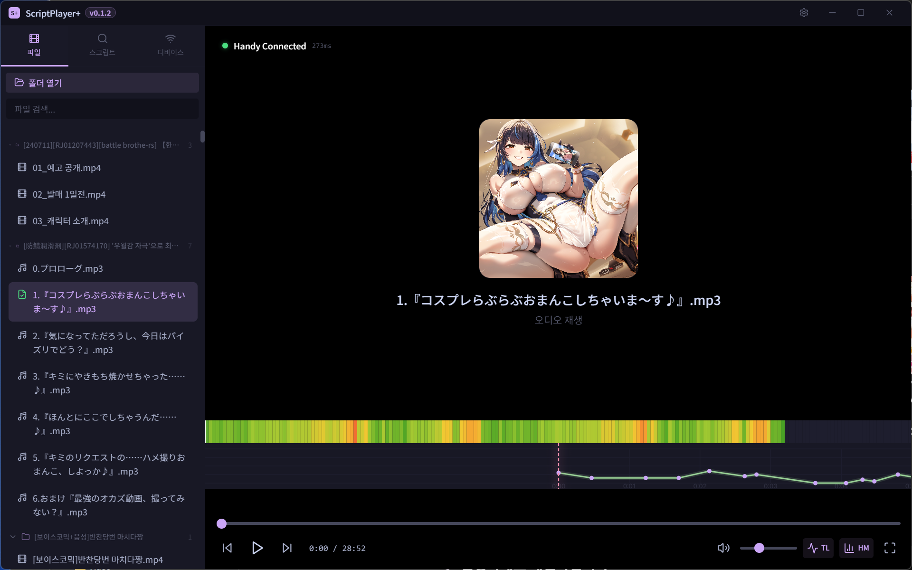
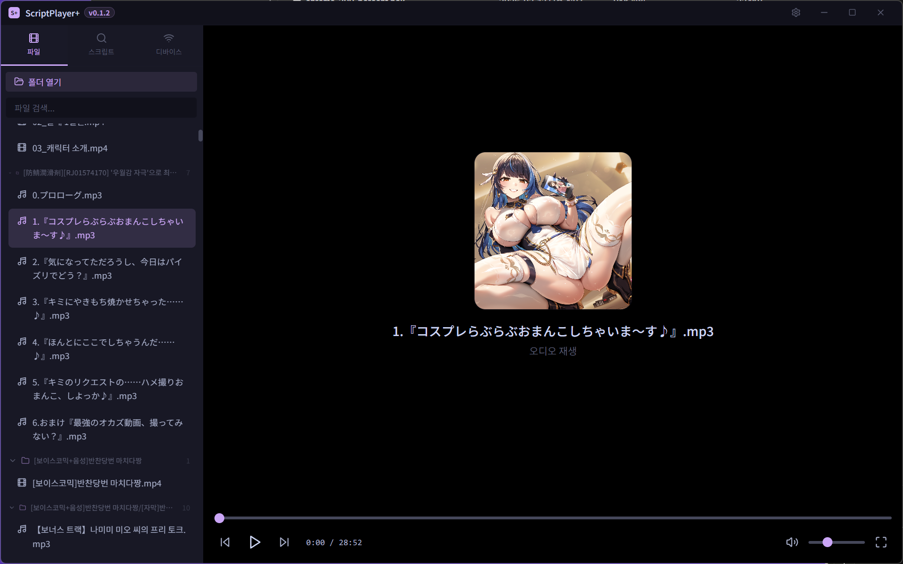
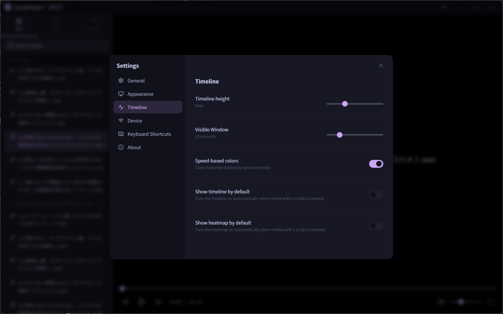
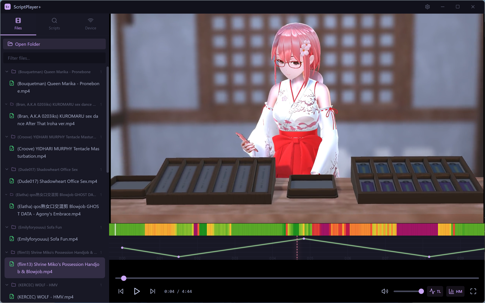
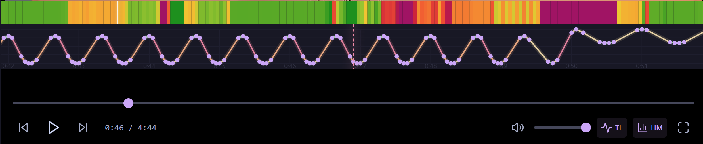
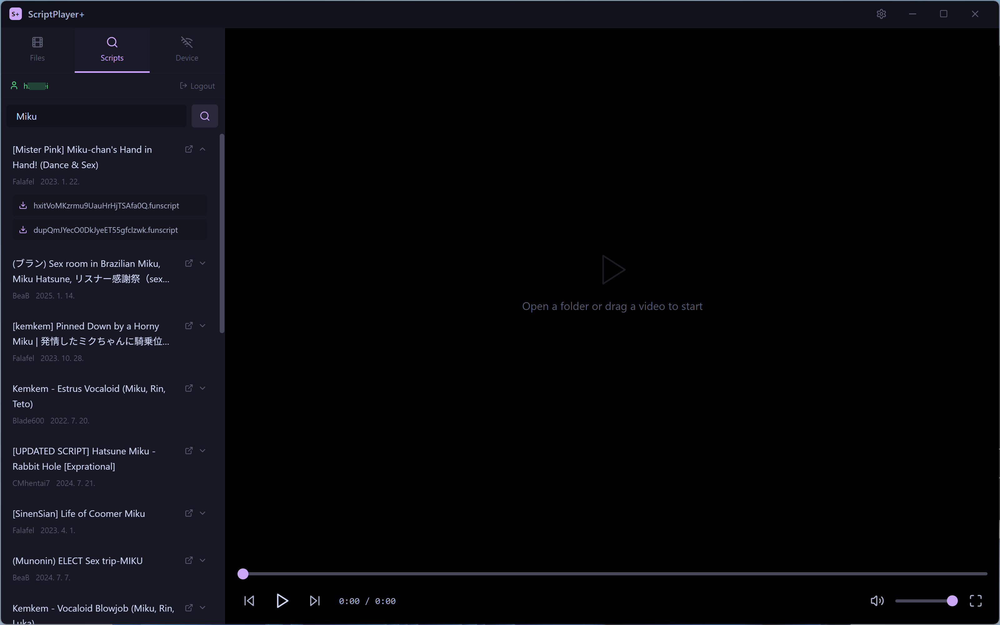
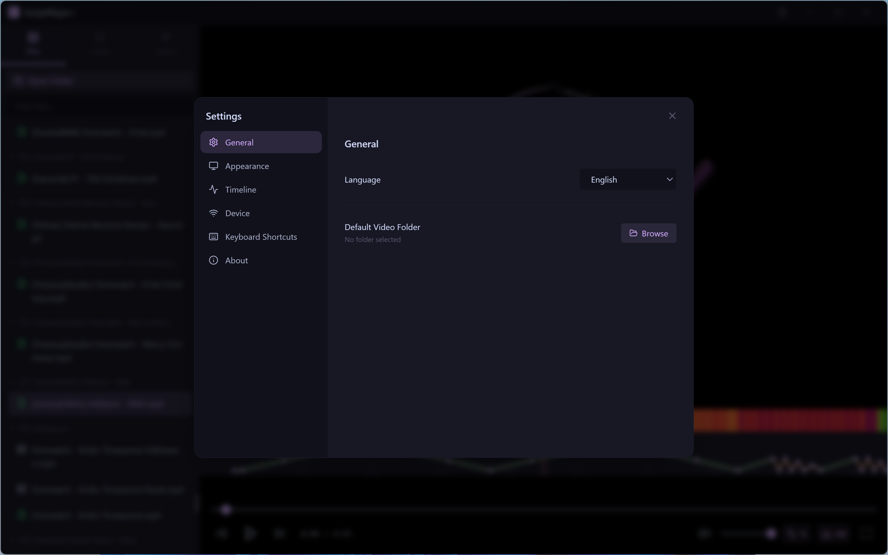
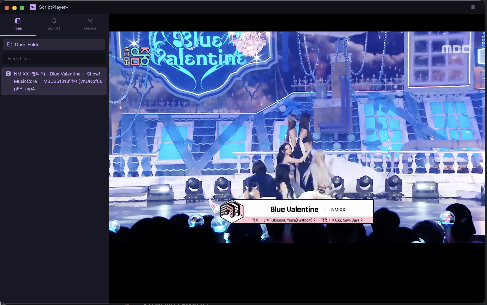

  

<h1 align="center">ScriptPlayer+</h1>

  集成 <b>The Handy</b> 设备、<b>Intiface / Buttplug / FunOSR</b> 多轴支持、<b>EroScripts</b> 浏览器登录和多语言支持的现代 Funscript 视频播放器

  <a href="../README.md">English</a> · <a href="README_KO.md">한국어</a> · <a href="README_JA.md">日本語</a> · <a href="README_ZH.md">中文</a>

---

## 截图

| v0.1.4 预览 | 设备设置 |
|:-:|:-:|
|  |  |

| 音频播放 + 热力图 | 音频播放 |
|:-:|:-:|
|  |  |

| 时间线设置 | Windows 播放 |
|:-:|:-:|
|  |  |

| 热力图和时间线 | EroScripts 搜索 |
|:-:|:-:|
|  |  |

| 设置 | macOS |
|:-:|:-:|
|  |  |

## v0.3.0 主要更新

- 重新设计了统一导航和可视化媒体库，同时保留可折叠的传统文件面板。
- 改进 `axes[]` / `channels{}` 合并多轴脚本解析、多轴同时显示和时间线高度调整。
- 新增 Range Extender、按媒体保存的输出范围、运动平滑，以及可直接输入数字的 `±60秒` 脚本偏移。
- 改进 Handy HSSP 恢复和自动播放，新增旧款 Handy 兼容模式与网络延迟诊断。
- 改进 FunOSR 串口 / Bluetooth COM 配置、重连、暂停 / Home 行为和平滑输出预设。
- 新增面向 JAVPlayer、JAVPlayerEZ、mpv、PotPlayer、VLC 和自定义程序的实验性外部播放器模式。
- 新增用于 Chromium 无法直接解码视频的实验性 FFmpeg 兼容播放。
- 改进音频封面 / 字幕检测，新增最高 `150%` 音量增强和专用配件自动重连。
- 新增同版本热修复检测、更新内容显示和应用内安装程序启动。

## 主要功能

- **视频 + 音频播放器** — 播放本地视频文件（MP4、MKV、AVI、WebM、MOV、WMV）和音频文件（MP3、WAV、FLAC、M4A、AAC、OGG、OPUS、WMA）
- **可视化媒体库** — 提供缩略图、评分、时长、排序和可折叠文件面板
- **音频封面检测** — 从元数据和作品目录中查找封面图与外部字幕
- **播放模式** — 支持连续播放、随机播放和可调播放速度
- **Funscript 支持** — 自动加载与媒体同名的 `.funscript` 文件
- **时间线可视化** — 可选择多个脚本轴同时显示并调整面板高度
- **热力图** — 整个媒体强度的颜色可视化（绿→黄→橙→红→紫）
- **可配置默认视图** — 可以在设置中分别控制时间线和热力图是否默认开启
- **The Handy 集成** — 通过 HSSP 协议与 The Handy 设备同步
  - 自动连接和连接历史
  - 脚本自动上传
  - 时间偏移调整
  - 行程范围自定义
  - 行程反转开关
- **脚本校正** — Range Extender、运动平滑、按媒体保存的 `±60秒` 偏移、间隙填充 / 自动跳过
- **Intiface / Buttplug 多轴支持** — 连接兼容设备，按功能映射脚本轴，并在可用时发送原始 TCode
- **FunOSR 支持** — 串口 / Bluetooth COM 配置、轴映射、重连、刷新率和平滑处理
- **外部播放器 / FFmpeg** — 支持播放器启动联动和实验性兼容播放
- **EroScripts 集成** — 通过应用内浏览器登录搜索和下载 Funscript（无需 API 密钥）
  - 登录会话保存在本地
  - 可直接下载到设置的脚本保存文件夹
- **多语言** — English、한국어、日本語、中文
- **拖放** — 直接将视频或音频文件拖入播放器
- **文件夹浏览器** — 子文件夹分组和脚本检测（绿色对勾）
- **键盘快捷键** — Space、方向键、F（全屏）、M（静音）等
- **跨平台** — Windows、macOS、Linux

## 安装

### Windows

1. 从 [Releases](https://github.com/sioaeko/scriptplayer-plus/releases) 下载最新的 Windows x64 构建
2. 运行安装程序，或解压便携版ZIP后运行 `ScriptPlayerPlus.exe`

### macOS

1. 从 [Releases](https://github.com/sioaeko/scriptplayer-plus/releases) 下载最新的 macOS 构建
2. 从DMG或ZIP中将`ScriptPlayerPlus.app`移动到Applications文件夹

### Linux

请使用发布页面提供的AppImage、DEB或压缩包。

## 当前说明

- 尚未解析视频容器内的内嵌字幕，请使用外部字幕文件。
- 外部播放器模式的控制与同步程度因播放器而异。
- FFmpeg兼容播放属于实验功能，需要可用的FFmpeg可执行文件。

## 源代码公开范围

ScriptPlayer+目前依据EULA以桌面二进制形式发布。公共仓库用于发布、更新元数据、文档和Issue跟踪，不公开完整应用源代码。

## 键盘快捷键

| 按键 | 操作 |
|------|------|
| `Space` / `K` | 播放 / 暂停 |
| `←` / `→` | 快进/快退 ±5秒 |
| `Shift + ←/→` | 快进/快退 ±10秒 |
| `↑` / `↓` | 音量 ±5% |
| `F` | 切换全屏 |
| `M` | 切换静音 |
| `Ctrl + ,` | 打开设置 |

## 技术栈

- **Electron** — 桌面应用框架
- **React** + **TypeScript** — UI 组件
- **Tailwind CSS** — 样式
- **Vite** — 构建工具
- **Handy API v2** — 设备通信
- **Discourse API** — EroScripts 集成

## 许可证

ScriptPlayer+ End User License Agreement

ScriptPlayer+ 是按照 [`LICENSE`](../LICENSE) 中的 EULA 条款分发的专有软件。
商业使用、再分发、修改或复用项目媒体均需要获得版权所有者的单独书面许可。

---

  使用 Electron、React 和 Tailwind CSS 构建

